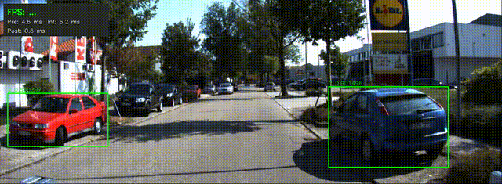

# 🚀 High-Throughput Real-Time Edge AI Inference System  
(TensorRT + Multi-thread + Asynchronous Pipeline)

## 🎬 Demo (Real-time Mode ~25 FPS)


## ⚡ High Throughput Mode (~60+ FPS)

The system can run significantly faster in offline mode by fully utilizing GPU through pipeline overlap.



## 📌 Project Overview

This project implements a high-performance edge AI inference system using TensorRT in C++.

A multi-threaded pipeline is designed to decouple capture, preprocessing, inference, and postprocessing.  
Cross-frame asynchronous execution enables CPU-GPU overlap, significantly improving throughput.

The system supports:
- Real-time mode (~25 FPS)
- High-throughput mode (~60+ FPS)

## 🏗️ System Architecture

```text
Capture → Preprocess → Inference (GPU) → Postprocess → Display
```
- Multi-thread pipeline
- Thread-safe queues with backpressure control
- Frame dropping strategy for real-time stability

## Pipeline Design
- Producer: continuously captures frames
- Preprocess: letterbox, normalization, CHW conversion
- Inference: TensorRT FP16 execution on GPU
- Postprocess: decode + NMS + rendering
- Consumer: real-time display

Data is passed through Task structures across threads.
Frame dropping is applied to ensure real-time performance.

## 📊 Performance

### Final Performance
- Real-time mode: ~25 FPS
- Throughput mode: ~60+ FPS
- Inference (GPU kernel): ~2–3 ms
- Preprocess: ~3 ms
- Postprocess: ~9 ms

### Optimization Steps
| Stage                      | FPS       |
|---------------------------|----------|
| Single-thread baseline     | ~5 FPS    |
| Multi-thread pipeline      | ~10 FPS   |
| TensorRT FP16 inference    | ~20 FPS   |
| Async pipeline overlap     | ~30+ FPS  |

## 💡 Technical Highlights

- Multi-threaded pipeline with backpressure control
- Cross-frame asynchronous execution (CPU-GPU overlap)
- Double buffering for efficient memory reuse
- TensorRT FP16 acceleration
- Real-time vs high-throughput dual-mode design
- End-to-end performance profiling (CPU + GPU)

## Technology Stack
- C++
- TensorRT
- CUDA
- OpenCV
- Multi-threading (std::thread, mutex, condition_variable)